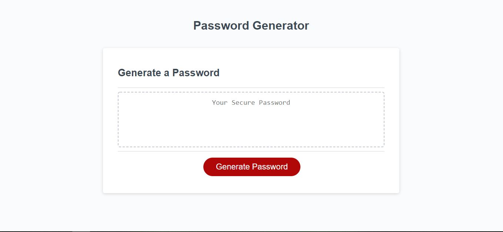
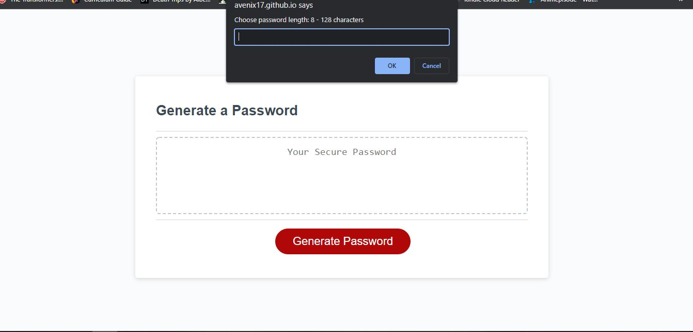
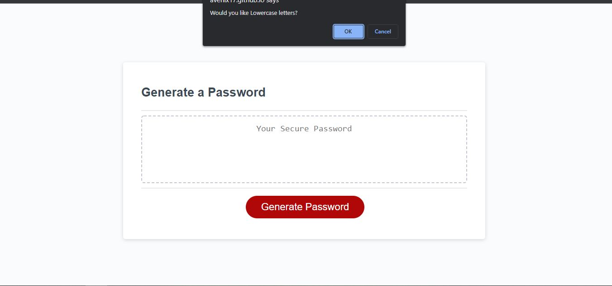
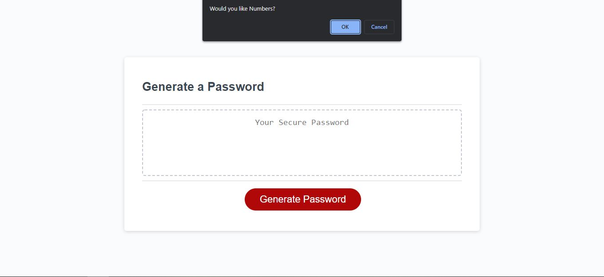
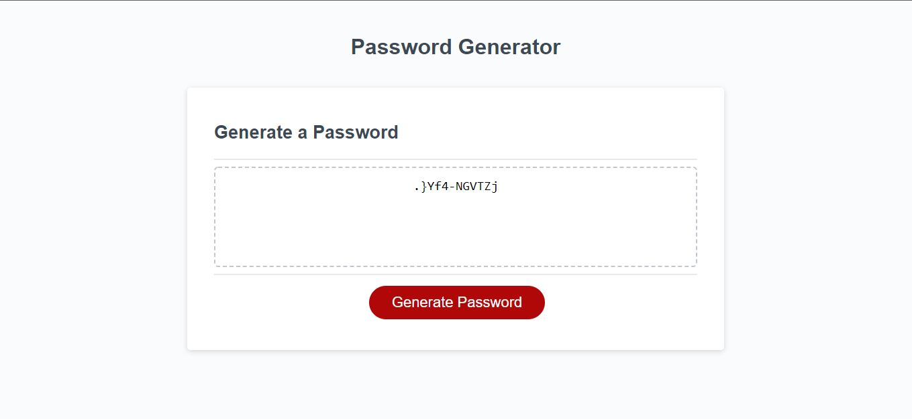

# Password Generator

## Description

This repository is a password generator for employees with access to sensitive data.

## Link to deployed application

[Password Generator](https://avenix17.github.io/Password-Generator/Develop/)

## Screenshots

## Change Log

### 2022-05-07

* Updated README
* Moved all images to new folder on main
* Created multiple screenshots for README
* Added application screenshot to main
* Added function randomShuffle to randomize password better
* Cleaned uneeded comments within script
* Added math random to each character type to ensure criteria was met
* Added alert message for false on all character type confirms, moved variables inside generatePassword function, and fixed charChoice to be an empty array
* Cleaned up console logs, psuedocode, and comments
* Created while loops for if statements

### 2022-05-05

* Added if statements and for loop to generatePassword
* Created prompt with while loop and confirms
* Created arrays for character types, global variables, and commented pseudocode